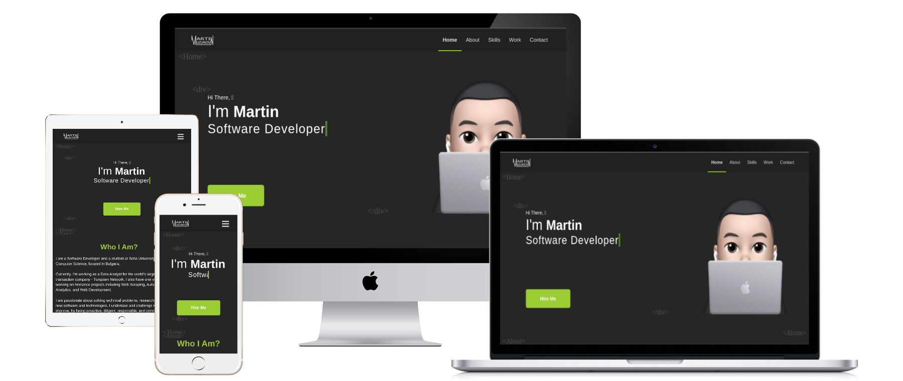

# Personal Website
See: [mruzunov.com](https://mruzunov.com).

My personal website. A simple, easily modifiable, fully responsive, modern, single-page application built using React and Typescript. Based on create-react-app with React-Router and Styled Components. The Back-End is built with Express and NodeMailer.



## Set up

To download the repository and install dependencies, run the following commands:

```bash
git clone git://github.com/mruzunov/portfolio-website.git 
cd portfolio-website
npm install
```

## Running

Run the following command to build the react application and serve it with fast refresh:

```bash
npm start
```

## License

Licensed under the [MIT License](https://github.com/MartinUzunov/portfolio-website/blob/master/LICENSE.md).